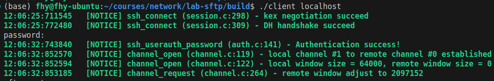
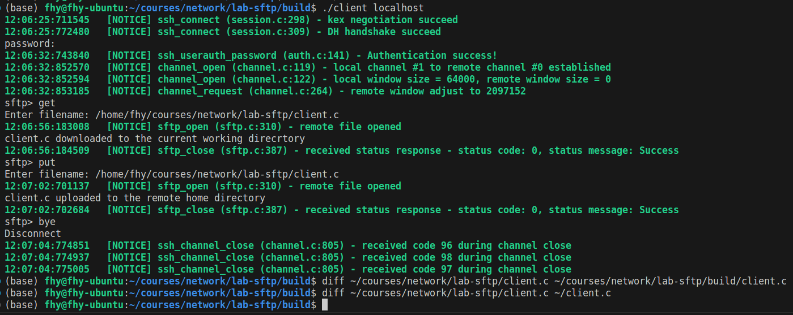

# Mini SFTP Client

### CP5

Local channel number was 1, and remote channel number was 0.

Local window size was 64000, and remote window size was 0 when the channel was firstly established. After the client requested an SFTP subsystem, the remote window was adjusted to 2097152.

### CP6

The client connected to the localhost and successfully uploaded and downloaded `client.c`. We compared the downloaded and uploaded files with the original file using command `diff`. Empty outputs mean that these three files are exactly the same.
