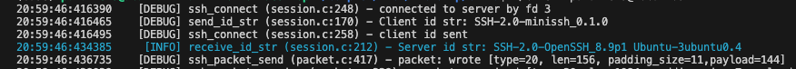
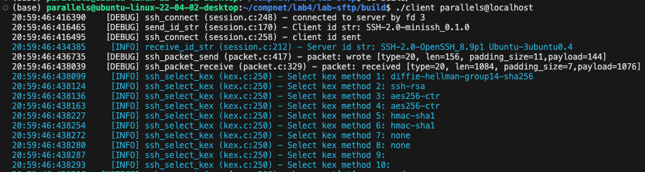
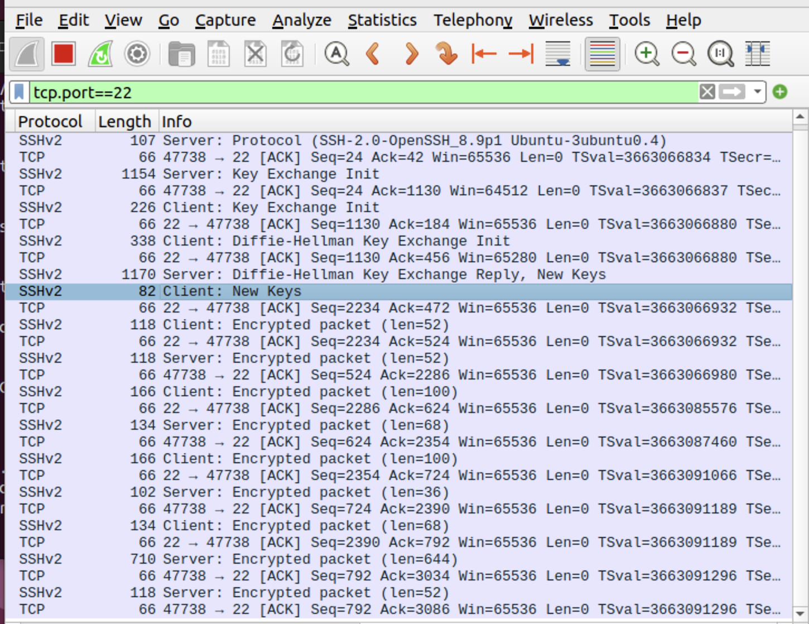
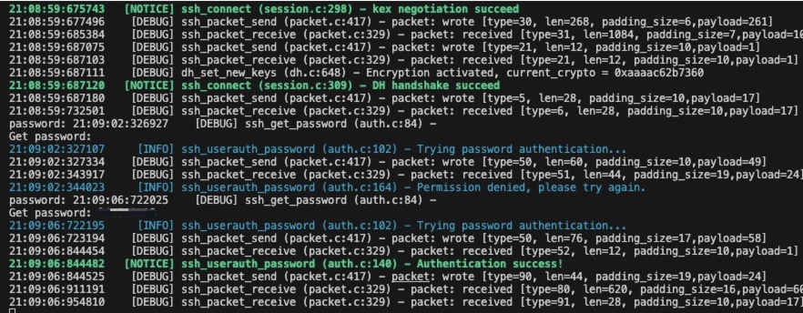

# Mini SFTP Client

### CP1

The server identification string is `SSH-2.0-OpenSSH_8.9p1 Ubuntu-3ubuntu0.4`.

### CP2

We can see the negotiate cipher suite in above figure.

### CP3

The above figure is the screenshot from wireshark. We can see that after the New Keys message, all messages are encrypted.

### CP4

When we input wrong password, the terminal will show `Permission denied, please try again.`. When we input correct password, the server grants access to the client.

### CP5

Local channel number was 1, and remote channel number was 0.

Local window size was 64000, and remote window size was 0 when the channel was firstly established. After the client requested an SFTP subsystem, the remote window was adjusted to 2097152.

### CP6

The client connected to the localhost and successfully uploaded and downloaded `client.c`. We compared the downloaded and uploaded files with the original file using command `diff`. Empty outputs mean that these three files are exactly the same.
